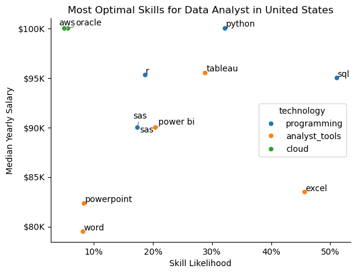

# Tools I Used

- **Python**: The backbone of my analysis, allowing me to analyze the data and find critical insights. I also used the following Python libraries:
    - **Pandas Library**: This was used to analyze the data.
    - **Matplotlib Library**: I visualized the data.
    - **Seaborn Library**: Helped me create more advanced visuals.
    
- **Jupyter Notebooks**: The tool I used to run my Python scripts which let me easily include my notes and analysis.

- **Visual Studio Code**: My go-to for executing my Python scripts.

- **Git & GitHub**: Essential for version control and sharing my Python code and analysis, ensuring collaboration and project tracking.

# The Analysis

## 1. What are the most demanded skills for the top 3 most popular data roles?

View my notebook with detailed steps here:    [2_Skill_Demand](2_Skill_Demand.ipynb)  

## 2. How are in-demand skills trending for Data Analysts?

View my notebook with detailed steps here:    [3_Skills_Trend](3_Skills_Trend.ipynb) 

## 3. How well do jobs and skills pay for Data Analysts?

View my notebook with detailed steps here:    [4_Salary_Analysis](4_Salary_Analysis.ipynb) 

## 4. What are the most optimal skills to learn for Data Analysts?

View my notebook with detailed steps here:    [5_Optimal_Skills](5_Optimal_Skills.ipynb) 

