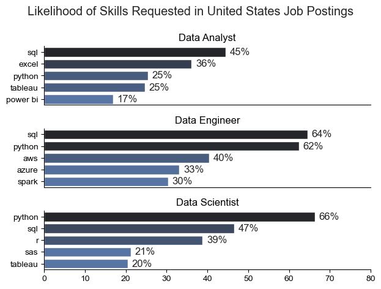
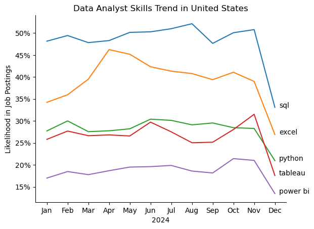
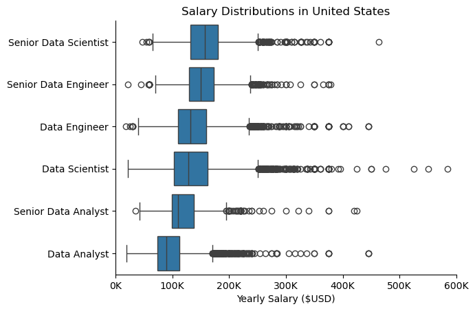
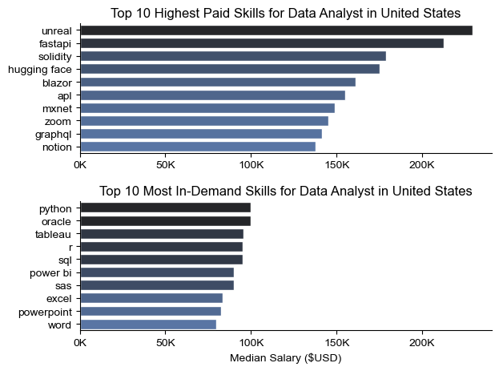

# Overview

Welcome to my analysis of the data job market, focusing on data analyst roles. This project was created out to navigate and understand the job market more effectively. It delves into the top-paying and in-demand skills to help find optimal job opportunities for data analysts.

The data sourced from [Luke Barousse's Python Course](https://lukebarousse.com/python) which provides a foundation for my analysis, containing detailed information on job titles, salaries, locations, and essential skills. Through a series of Python scripts, I explore key questions such as the most demanded skills, salary trends, and the intersection of demand and salary in data analytics.  

# The Questions

Below are the questions I want to answer in my project:

1. What are the skills most in demand for the top 3 most popular data roles?
2. How are in-demand skills trending for Data Analysts?
3. How well do jobs and skills pay for Data Analysts?
4. What are the optimal skills for data analysts to learn? (High Demand AND High Paying) 

# Tools I Used

- **Python**: The backbone of my analysis, allowing me to analyze the data and find critical insights. I also used the following Python libraries:
    - **Pandas Library**: This was used to analyze the data.
    - **Matplotlib Library**: I visualized the data.
    - **Seaborn Library**: Helped me create more advanced visuals.
- **Jupyter Notebooks**: The tool I used to run my Python scripts which let me easily include my notes and analysis.
- **Visual Studio Code**: My go-to for executing my Python scripts.
- **Git & GitHub**: Essential for version control and sharing my Python code and analysis, ensuring collaboration and project tracking.

# The Analysis

## 1. What are the most demanded skills for the top 3 most popular data roles?

View my notebook with detailed steps here:    [2_Skill_Demand](2_Project/2_Skill_Demand.ipynb)  

## 2. How are in-demand skills trending for Data Analysts?

View my notebook with detailed steps here:    [3_Skills_Trend](2_Project/3_Skills_Trend.ipynb) 

## 3. How well do jobs and skills pay for Data Analysts?

View my notebook with detailed steps here:    [4_Salary_Analysis](2_Project/4_Salary_Analysis.ipynb) 

